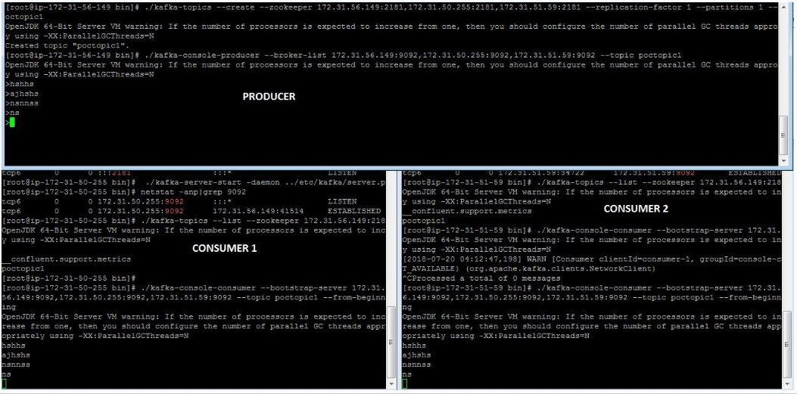
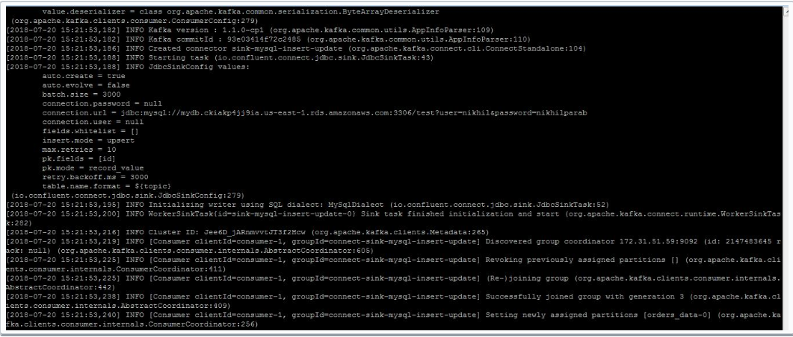
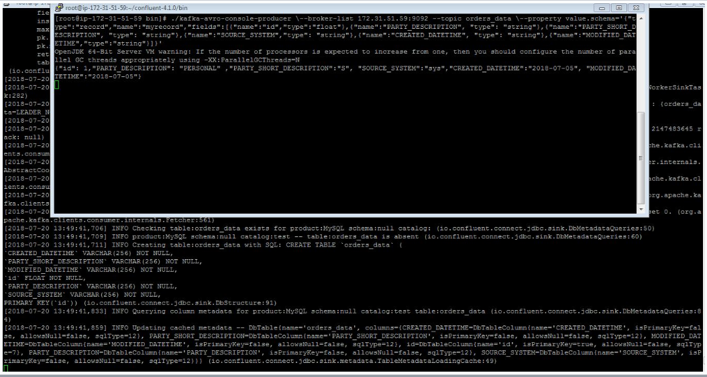
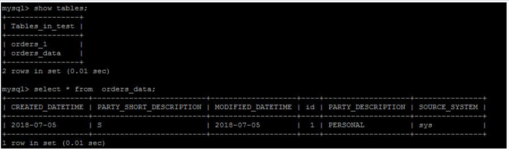
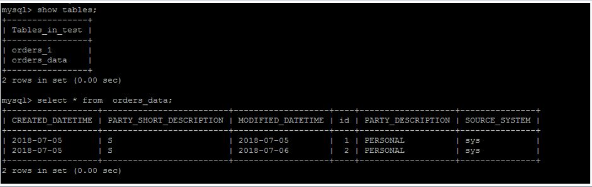
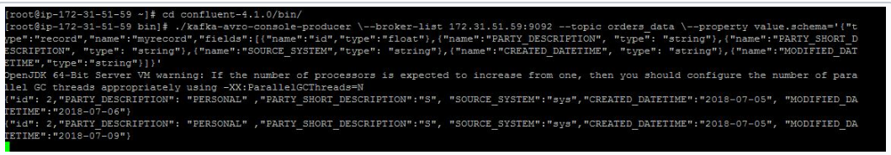
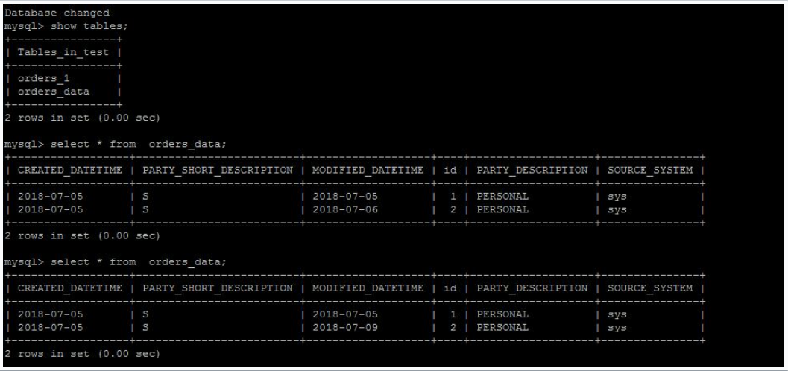

######################
Steps to be followed
######################

Step1
=======

- Install java8 on each server(login to root)

.. code-block:: bash  
 
  $yum install java

Step2
=====  

- Download confluent on each server using following command

.. code-block:: bash

  $wget http://packages.confluent.io/archive/4.1/confluent-oss-4.1.0-2.11.tar.gz

  $tar –xvf  confluent-oss-4.1.0-2.11.tar.gz'
                       
Step3
=====

- Start the zookeeper on each server using following command.

- Go to the `bin` location of confluent(form me it's in root)

.. code-block:: bash
  
   $cd /root/confluent-4.1.0/bin

   $./zookeeper-server-start  ../etc/kafka/zookeeper.properties

- If it is running on 2181 port then start it in daemon mode as follow

.. code-block:: bash
 
   $ ./zookeeper-server-start -daemon ../etc/kafka/zookeeper.properties

   $netstat -anp|grep 2181     (for checking, it is running or not)

Step4
======

- Start the kafka server on each server.

- Change the following parameters in ``server.properties`` on each server.It is resides into ``/root/confluent-4.1.0/etc/kafka/`` location.

        `broker.id=0  (change for each server as 0,1,2)`
        `listeners=PLAINTEXT://hostname or ip address:9092`
        `zookeeper.connect=x.x.x.x:2181,x.x.x.x:2181,x.x.x.x:2181(add other server ip with 2181 port)`

- Now start kafka server using following command

.. code-block:: bash

   $ cd /root/confluent-4.1.0/bin
 
   $./kafka-server-start  ../etc/kafka/server.properties

- If it running on port 9092 then again start it in daemon mode as follow

.. code-block:: bash

   $./kafka-server-start -daemon ../etc/kafka/server.properties

   $netstat -anp|grep 9092 

Step5
=====

- Check the cluster setup. 

- Create a topic on one of the server.

.. code-block:: bash 
   
   $cd  /storage/confluent-4.1.0/
    
   $./kafka-topics --create --zookeeper x.x.x.x:2181,x.x.x.x:2181,x.x.x.x:2181 -- replication-factor 1 --partitions 1 --topic demotopic

- You can check that topic is created on each server using following command

.. code-block:: bash
 
   $./kafka-topics --list --zookeeper  x.x.x.x:2181,x.x.x.x:2181,x.x.x.x:2181

It will list topic which is created.

- start the producer in the same terminal of topic

.. code-block:: bash

   $./kafka-console-producer --broker-list  x.x.x.x:9092,x.x.x.x:9092,x.x.x.x:9092 --topic demotopic

- Start the consumer on other two servers

.. code-block:: bash

   $./bin/kafka-console-consumer --bootstrap-server x.x.x.x:9092,x.x.x.x:9092,x.x.x.x:9092 --topic demotopic --from-beginning

Now you can send the messages from producer and those messages get populated at consumers as follow

Step6
======

- Install mysql on one of the server and start the mysql service(login to root)

.. code-block:: bash

   $yum install mysql-server

   $service mysqld start

   Step7

- Create mysql instance on aws and login to mysql instance as follow

.. code-block:: bash

   $mysql –h <hostname of mysql instance> -u <username> -p <password>

- Download mysql-connector-java.jar and place it in confluent-4.1.0/share/java/kafka-connect-jdbc/ 

- For aws mysql connection download following package 

.. code-block:: bash

    $yum list|grep mysql

    $wget http://repo.mysql.com/mysql-community-release-el7-5.noarch.rpm
           
    $rpm  -ivh mysql-community-release-el7-5.noarch.rpm 

- Set the classpath on one of the server where you want to run schema registry and connect- statndlone 

.. code-block:: bash

    $ export CLASSPATH=$CLASSPATH:.:/root/confluent-4.1.0/share/java/kafka-connect-jdbc/mysql-connector-java-               5.1.46.jar:/root/confluent-4.1.0/share/java/kafka-connect-jdbc/kafka-connect-jdbc-4.1.0.jar

    $ export CLASSPATH=/usr/share/java/mysql-connector-java.jar:$CLASSPATH

Step8
======

- Start schema registry on same server where you set classpath

- Change <kafkastore.bootstrap.servers=PLAINTEXT://x.x.x.x:9092> in "/root/confluent-4.1.0/etc/schema-registry/schema-registry.properties" file.

- Start schema registry as follow

.. code-block:: bash

   $cd /storage/confluent-4.1.0/bin

   $./schema-registry-start ../etc/schema-registry/schema-registry.properties

If is is running on port 8081 then start it in daemon mode 

.. code-block:: bash

   $./schema-registry-start -daemon ../etc/schema-registry/schema-registry.properties

   $netstat -anp|grep 8081

- Change following parameter in "connect-avro-standalone.properties" file.

       ``bootstrap.servers=x.x.x.x:9092`` 
       
       ``rest.port=8083``

- create a file at "/root/confluent-4.1.0/etc/kafka-connect-jdbc/sink-mysql-jdbc.properties" with bellow content

       ``name=sink-mysql-insert-update``
       
       ``connector.class=io.confluent.connect.jdbc.JdbcSinkConnector``
       
       ``tasks.max=1``
       
       ``topics=orders_data``
       
       ``connection.url=jdbc:mysql://hostname:3306/test?user=test&password=test``
       
       ``auto.create=true``
       
       ``insert.mode=upsert``
       
       ``pk.mode=record_value``
       
       ``pk.fields=id``
       
       ``#key.serializer=org.apache.kafka.common.serialization.StringSerializer``
       
       ``#key.converter=org.apache.kafka.connect.storage.StringConverter``
       
       ``key.converter=org.apache.kafka.connect.storage.StringConverter``
       
       ``#value.converter=org.apache.kafka.connect.storage.StringConverter``
       
       ``#key.serializer=io.confluent.kafka.serializers.KafkaAvroSerializer``
       
       ``#value.serializer=io.confluent.kafka.serializers.KafkaAvroSerializer``

- Start kafka standalone as follow

.. code-block:: bash

     $cd /root/confluent-4.1.0/bin  
    
     $./connect-standalone  ../etc/schema-registry/connect-avro-standalone.properties  ../etc/kafka-connect-jdbc/sink-mysql-jdbc.properties

- Open another terminal for same server as above and start avro console producer 

.. code-block:: bash

    $cd  confluent-4.1.0/bin

    $ ./kafka-avro-console-producer \--broker-list x.x.x.x:9092 --topic orders_data \--property    value.schema='{"type":"record","name":"myrecord","fields":[{"name":"id","type":"float"{"name":"PARTY_TYPE_ID","type":"float"},{"name":"PARTY_DESCRIPTION", "type": "string"},{"name":"PARTY_SHORT_DESCRIPTION", "type": "string"},{"name":"SOURCE_SYSTEM","type": "string"},{"name":"CREATED_DATETIME", "type": "string"}{"name":"MODIFIED_DATETIME","type":"string"}]}'

It will get hang for some time. You have to enter the values as follow

       {"id": 1,"PARTY_TYPE_ID":100,"PARTY_DESCRIPTION": "PERSONAL" ,"PARTY_SHORT_DESCRIPTION":"S",     "SOURCE_SYSTEM":"sys","CREATED_DATETIME":"2018-07-05", "MODIFIED_DATETIME":"2018-07-09"}

  
- The table will get create(same as topic name) in mysql. Start the mysql on other server

  
- You can update the data. Insert the different value for same id. You can see the value get updated in mysql

e.g. Original  value of MODIFIED_DATE for id 2 is 2018-07-06

  
- Updated value

  

