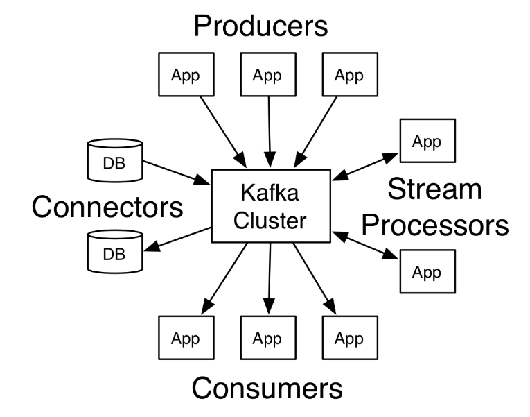

################################
Introduction to Kafka
################################

..  Licensed to the Apache Software Foundation (ASF) under one
    or more contributor license agreements.  See the NOTICE file
    distributed with this work for additional information
    regarding copyright ownership.  The ASF licenses this file
    to you under the Apache License, Version 2.0 (the
    "License"); you may not use this file except in compliance
    with the License.  You may obtain a copy of the License at

..    http://www.apache.org/licenses/LICENSE-2.0

..  Unless required by applicable law or agreed to in writing,
    software distributed under the License is distributed on an
    "AS IS" BASIS, WITHOUT WARRANTIES OR CONDITIONS OF ANY
    KIND, either express or implied.  See the License for the
    specific language governing permissions and limitations
    under the License.
    

Apache Kafka is a distributed streaming platform. What exactly does that mean?
'''''''''''''''''''''''''''''''''''''''''''''''''''''''''''''''''''''''''''''''

A streaming platform has three key capabilities:
^^^^^^^^^^^^^^^^^^^^^^^^^^^^^^^^^^^^^^^^^^^^^^^^

- Publish and subscribe to streams of records, similar to a message queue or enterprise messaging system.
- Store streams of records in a fault-tolerant durable way.
- Process streams of records as they occur.

Kafka is generally used for two broad classes of applications:
^^^^^^^^^^^^^^^^^^^^^^^^^^^^^^^^^^^^^^^^^^^^^^^^^^^^^^^^^^^^^^

- Building real-time streaming data pipelines that reliably get data between systems or applications
- Building real-time streaming applications that transform or react to the streams of data

  

Kafka cluster and  Kafka connect JDBC sinc setup(e.g. For 3 nodes cluster) 
--------------------------------------------------------------------------

Use-Case
^^^^^^^^

In this setup we are going to send data from kafka avro producer to aws aurora mysql database. For this we are using avro converter to convert schema.

.. toctree::
   :maxdepth: 2

   StepsTobeFollowed
